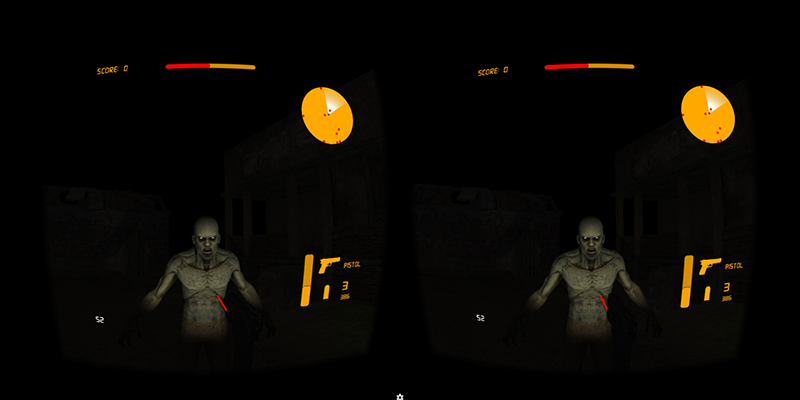

# ZombieShooterVR #

Proof of concept game integrating Thalmic Myo and Google Cardboard.

# Screenshots #
## Tutorial ##

## In Game ##

# Controls #
* Hand movement controls gun independently on head movement.
* Myo gestures
    * Fist - Shooting
    * Fingers spread - Resets gun to a "zero" position
    * Wave In / Wave Out - Weapon switching
* Raise hand to reload

# Credits #
[See credits here](Credits.md)

# Download #
[Download the game from GooglePlay](https://play.google.com/store/apps/details?id=com.st3vev.games.zombieshooter)
