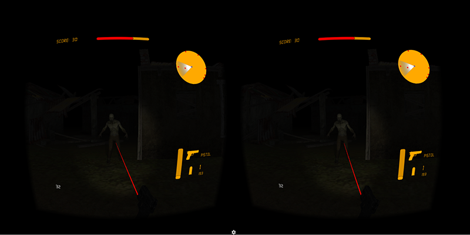

# ZombieShooterVR #

Proof of concept game integrating Thalmic Myo and Google Cardboard.

# Screenshots #

# Controls #
* Hand movement controls gun independently on head movement.
* Myo gestures
    * Fist - Shooting
    * Fingers spread - Resets gun to a "zero" position
    * Wave In / Wave Out - Weapon switching
* Raise hand to reload

# Credits #
[See credits here](Credits.md)
